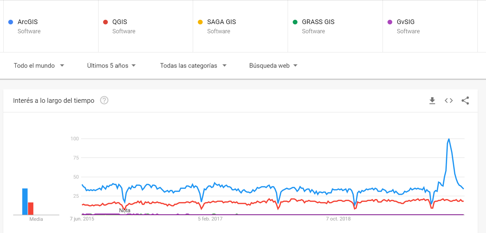
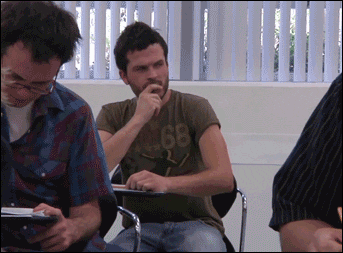
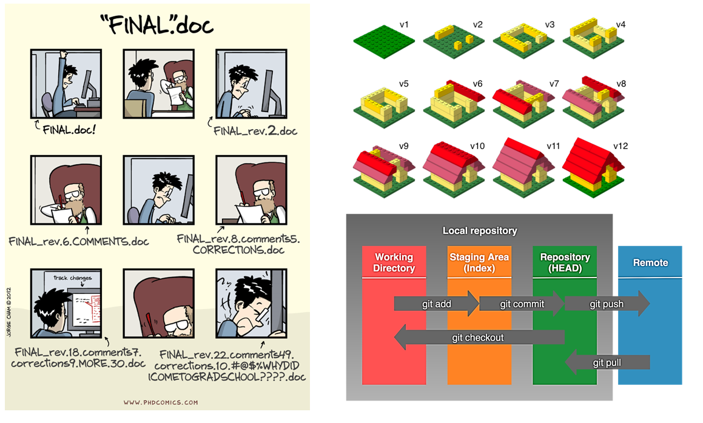
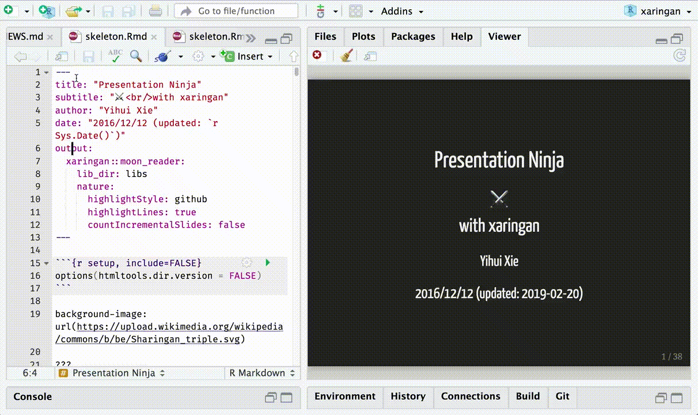

```{r child = "../setup.Rmd"}
```

```{r packages, echo=FALSE, message=FALSE, warning=FALSE}
# AGREGAR PAQUETES A UTILIZAR

```
class: center

## Acerca de mí

.left-column-image[
  
]

.left-column[
- Ingeniería ambiental / UNALM.
- Consultor del International Potato Center (CIP/CGIAR) en el área de Research Informatics Unit (RIU).
- Vicepresidente del Círculo de Investigación en Minería y Medio Ambiente (CIMMA/UNALM).
- Docente con más de 150 horas de experiencia en el dictado de cursos de Sistemas de Información Geográfica con ArcGIS, R y Python.
 ]

---

# ¿Por qué aprender ArcGIS?

  

 <a href="https://trends.google.com/" class='center'> Acceder a Google Trends </a>

---

# ¿Por qué aprender ArcGIS?

  

 <a href="https://desktop.arcgis.com/es/arcmap/" class='center'> Acceder a la documentación de ArcGIS Desktop </a>

---

# ¿Por qué aprender ArcGIS?

  

 <a href="https://www.arcgis.com/" class='center'> Acceder a la web de ArcGIS </a>

---

class: syllabus

## Contenido analítico

<b> CLASE 1 : FUNDAMENTOS DE LOS SISTEMAS DE INFORMACIÓN GEOGRÁFICA (GIS) </b>

- ¿Qué son los GIS?
- Componentes de los GIS
- Conceptos geodésicos básicos
- Elipsoide y Datum
- Las proyecciones cartográficas
- La Información geográfica y sus componentes
- Aplicaciones de los GIS
- ArcGIS y sus componentes principales
- ArcGIS for Desktop: ArcMap, ArcCatalog, ArcToolbox
- La representación vectorial y sus formatos
- Multiarchivo shapefile (.shp)
- La representación raster y sus formatos
- El Geopackage
- ¿Dónde puedo descargar información geográfica?
- Servicios WMS
- El geoprocesamiento

---

class: syllabus

## Contenido analítico

<b> CLASE 2 :  FUNDAMENTOS DE LA TELEDETECCIÓN </b>

- 
- 
- 
- 
- 
- 

---

class: syllabus

## Contenido analítico

<b> CLASE 3 :  ANÁLISIS DE MODELOS DE ELEVACIÓN DIGITAL (DEM) </b>

- 
- 
- 
- 
- 
- 

---
class: syllabus

## Contenido analítico

<b> CLASE 4 :  ANÁLISIS ESPACIAL DE DATOS AMBIENTALES </b>

- 
-
- 
- 
- 

---


class: syllabus

## Contenido analítico

<b> CLASE 5 :  ANÁLISIS HIDROLÓGICO CON "HIDROLOGY" </b>

- 
-
- 
- 
- 
- 

---

## Sistema de evaluación

- Trabajos encargados  &nbsp;  &nbsp;| 30%
- Examen teórico &nbsp;  &nbsp;  &nbsp;  &nbsp;  &nbsp;  &nbsp;  &nbsp; | 30%
- Proyecto final &nbsp;  &nbsp;  &nbsp;  &nbsp;  &nbsp;  &nbsp;  &nbsp;  &nbsp;  &nbsp;| 40% 

<br/>



---

class: inverse, center, middle

# INVESTIGACIÓN REPRODUCIBLE

---

## Git y GitHub

- [Git](https://git-scm.com/) es el sistema de control de versiones más utilizado en el mundo.
- [GitHub](https://github.com/) es una plataforma para alojar proyectos Git.



---

## RMarkdown

- [RMarkdown](https://rmarkdown.rstudio.com/) integra paquetes de R y herramientas externas con la finalidad de proveer un marco de referencia para la construcción de documentación completamente reproducible.



---

class: inverse, center, middle

# GRACIAS! <br/>  <a href="mailto: marvinjqs@gmail.com">  </a> 


