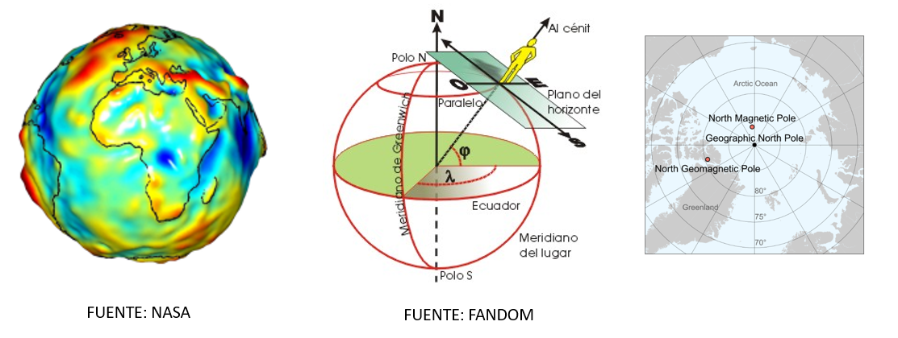
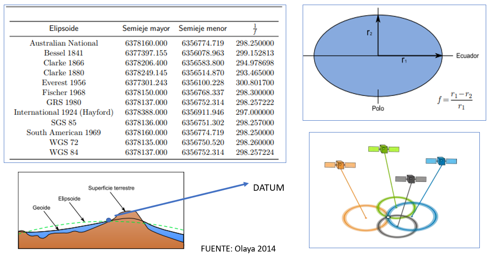
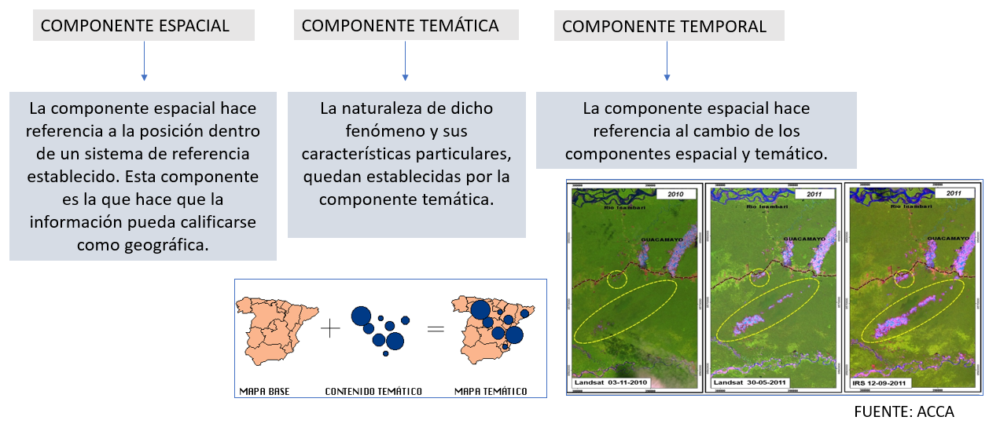

```{r child = "../setup.Rmd"}
```

```{r packages, echo=FALSE, message=FALSE, warning=FALSE}
# AGREGAR PAQUETES A UTILIZAR

```
class: inverse, center, middle

## CLASE 1 
### FUNDAMENTOS DE LOS SISTEMAS DE INFORMACIÓN GEOGRÁFICOS

---

## ¿Qué son los GIS?

Según Olaya (2014), un Sistema de Información Geográfica permite la realización las siguientes operaciones: 

- Lectura, edición, almacenamiento y, en términos generales, gestión de datos espaciales. 
- Análisis de datos espaciales, desde consultas sencillas a la elaboración de complejos modelos, y puede llevarse a cabo tanto sobre la componente espacial de los datos (la localización de cada valor o elemento) como sobre la componente temática (el valor o el elemento en sí).
- Generación de resultados tales como mapas, informes, gráficos, etc.

---

## Componentes de los GIS

  
  
---
  
## Componentes de los GIS

A la hora de definir la forma y dimensiones de la Tierra, la geodesia plantea modelos que puedan recoger la complejidad natural de la superficie terrestre y expresarla de una forma más simple y fácil de manejar (Olaya 2014).

 

---

## Elipsoide y datum



---

## Las proyecciones cartográficas


---

## Las proyecciones cartográficas


---

## Las proyecciones cartográficas


---

## La información geográfica

La información geográfica es el resultado de un dato y una interpretación (Olaya 2014).  <br/>  <br/>



---
