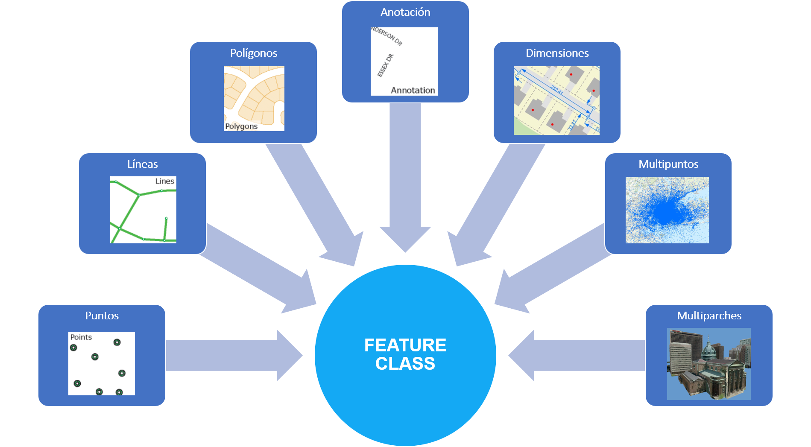
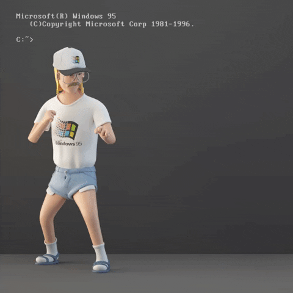

```{r child = "../setup.Rmd"}
```

```{r packages, echo=FALSE, message=FALSE, warning=FALSE}
# AGREGAR PAQUETES A UTILIZAR

```
class: inverse, center, middle

## CLASE 2 
### GESTIÓN DE DATOS ESPACIALES

---

## ¿Qué son los datos espaciales?

- Es un término utilizado para describir cualquier dato que este relacionado o contenga información sobre una ubicación específica dentro de la superficie terrestre.
- ArcGIS es compatible con una gran cantidad de formatos de datos espaciales, muchos de los cuales son nativos de ESRI <a href="https://desktop.arcgis.com/es/arcmap/latest/manage-data/datatypes/about-geographic-data-formats.htm">(Ver lista completa)</a>.


  

---

## Feature class

- Un feature class <i>(en español clase de entidad)</i> es una colección de entidades geográficas que comparten el mismo tipo de geometría y los mismos campos de atributo para un área común.




---
class: center

# .instructions[CUIDADO !!]

- Los siguientes caracteres causan problemas en nombres:

.instructions[
~, ` , ! , @, # , $ , % , ^ , & , (,) , - , + , = , {,} , 

[,], ; , \ , / , : , * , ? , ' , " , < , > , | , 

coma (,) , punto (.) y un espacio.
]




---


