```{r child = "../setup.Rmd"}
```

```{r packages, echo=FALSE, message=FALSE, warning=FALSE}
# AGREGAR PAQUETES A UTILIZAR

```
class: inverse, center, middle

## CLASE 3 
### FUNDAMENTOS DE LA TELEDETECCIÓN

---

## ¿Qué es la teledetección?

- La teledetección (también llamado sensoramiento remoto) es la ciencia y tecnología mediante la cual las características de los objetos de interés pueden identificarse, medirse o analizarse sin contacto directo (JARS, 1993).

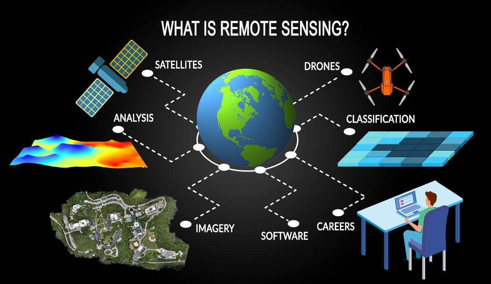

---

## El estudio de la tierra con satélites

Algunas de las ventajas que nos ofrece el uso de los satélites en el estudio del sistema Tierra son:

- Mediciones constantes y rutinarias a escala global.
- Perspectiva general de la información y a diferentes escalas.
- Ofrecer información para aquellas áreas donde no existen mediciones terrestres de parámetros.
- Alerta temprana sobre eventos meteorológicos, delitos ambientales, desastres inminentes, entre otros.
- Atractivo visual de las imagenes.

---

class: center

<br/>


### .instructions[UNA IMAGEN VALE MÁS QUE MIL PALABRAS!]

---

## El proceso de la teledetección

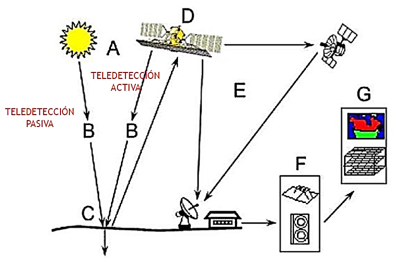

---

class: inverse, center, middle

## BASES FÍSICAS DE LA TELEDETECCIÓN

---

## La radiación electromagnética

- La radiación electromagnética es una combinación de campos eléctricos y magnéticos oscilantes, que se propagan a través del espacio transportando energía de un lugar a otro.
- La radiación electromagnética se puede expresar en términos de energía, longitud de onda o frecuencia .


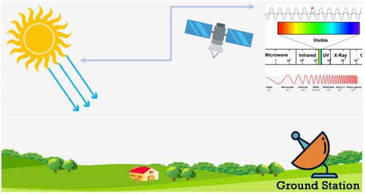

---

## La radiación electromagnética

- La radiación electromagnética es una combinación de campos eléctricos y magnéticos oscilantes, que se propagan a través del espacio transportando energía de un lugar a otro.
- La radiación electromagnética se puede expresar en términos de energía, longitud de onda o frecuencia.

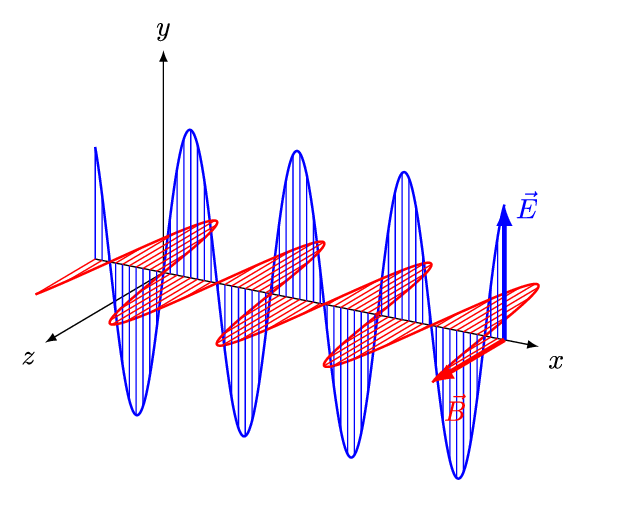

---

##  Interacción onda/materia

- Todas las ondas electromagnéticas se pueden reflejar, refractar, difractar, absorber, dispersar, y experimentar interferencias debido a su interacción con la materia a la hora de desplazarse.

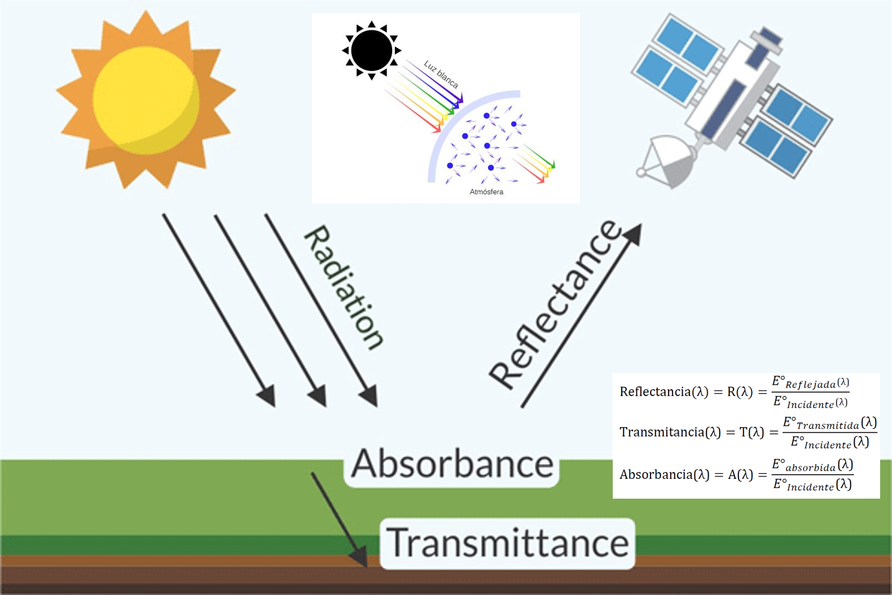

---

##  Interacción onda/materia

- Antes que la radiacion electromagnética emitida por el sol (o un sensor activo) alcance la superficie terrestre, interactua con los gases y partículas de la atmósfera.


---

## La polarización electromagnética

- Es una propiedad de las ondas electromagnéticas, la cual hace referencia a su posible oscilación con más de una orientación.
- gg

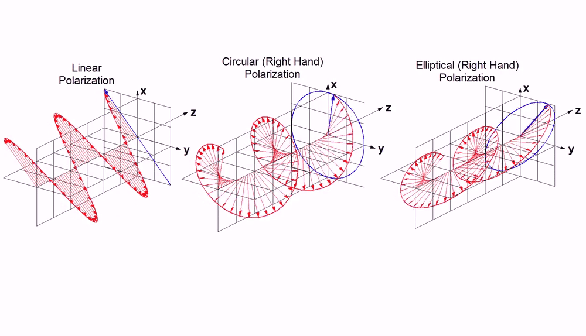

---

## El espectro electromagnético

- Es la distribución energética del conjunto de ondas electromagnéticas.

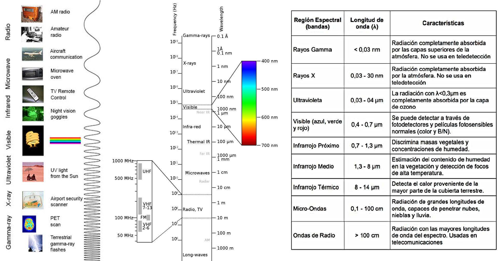

---

## La irradiación solar

- La irradiación solar mide la energía por unidad de área de radiación solar incidente en una superficie colocada en un lugar y tiempo especificados.
- La radiación solar es reflejada, absorbida o dispersada por la atmósfera terrestre debido a la acción de átomos, moléculas, iones, gases disueltos y partículas en suspensión.

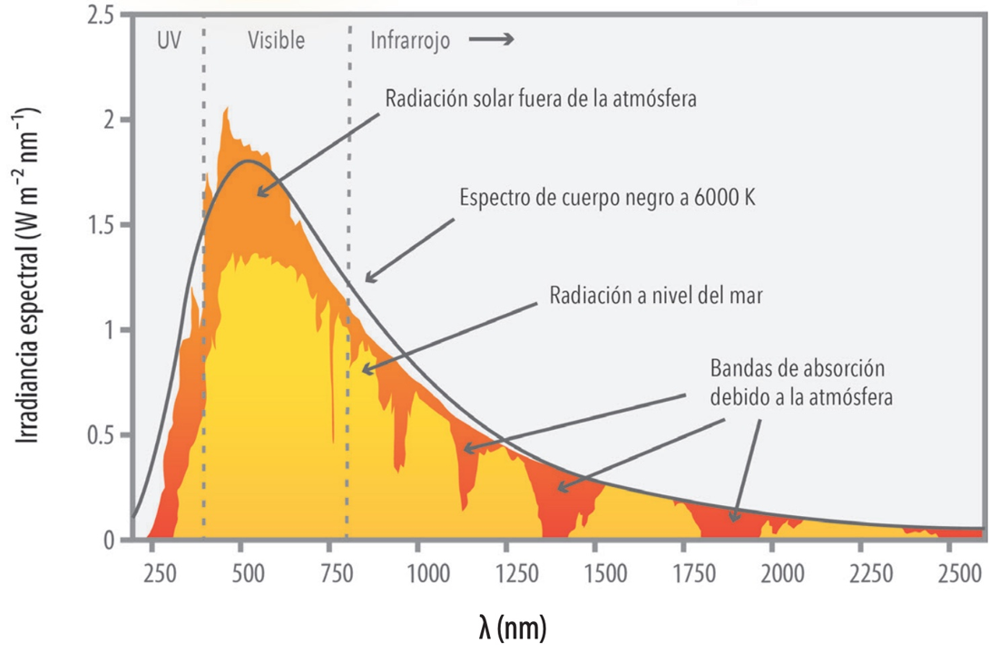

---

## La firma espectral

- La firma espectral es la radiación reflejada (reflectancia), por determinada superficie, medida en función de la longitud de onda (ESA, 2014).
- La firma espectral es única para cada elemento.

<br/>

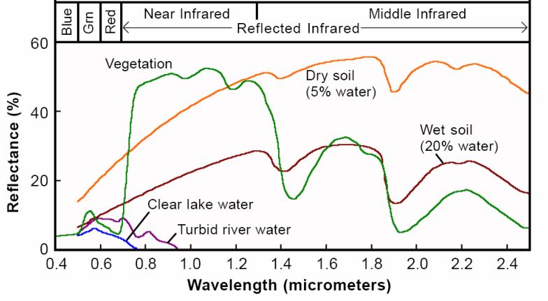

---

class: inverse, center, middle

## IMÁGENES SATELITALES

---

## ¿Qué es una imagen satelital?

- Se define como la representación visual de la información capturada por un sensor montado en una plataforma artificial (también llamado satélite).


---


## Satélites y sensores

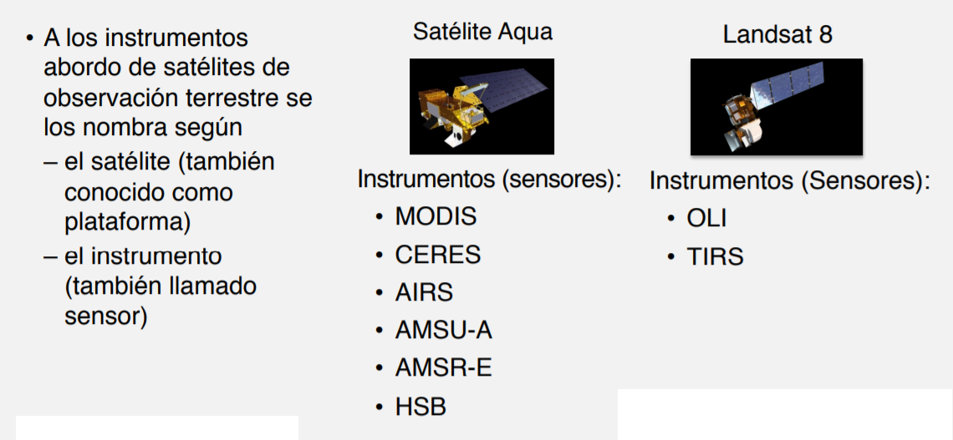


---

## Resoluciones de una imagen satelital

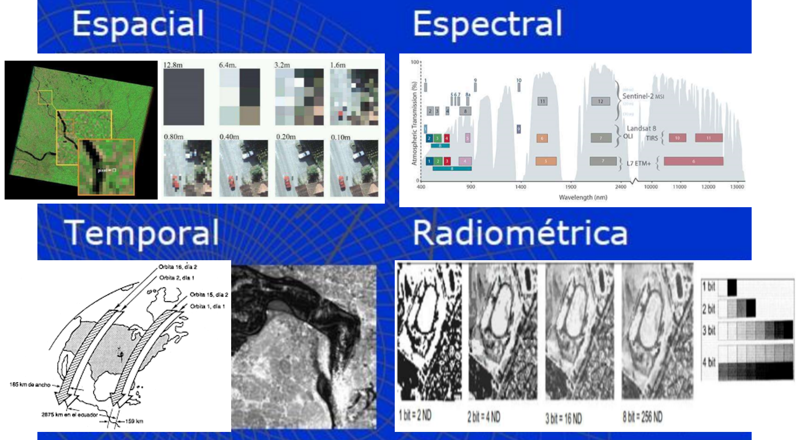


---

class: inverse, center, middle

# GRACIAS! <br/>  <a href="mailto: marvinjqs@gmail.com">  </a> 


