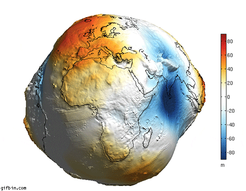
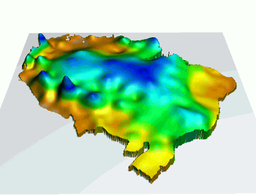
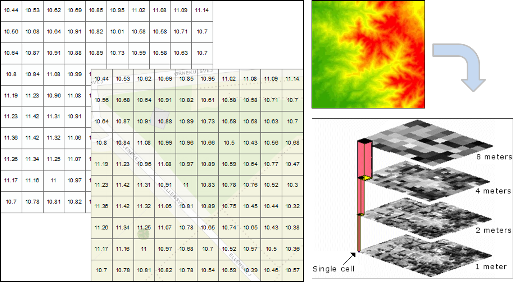
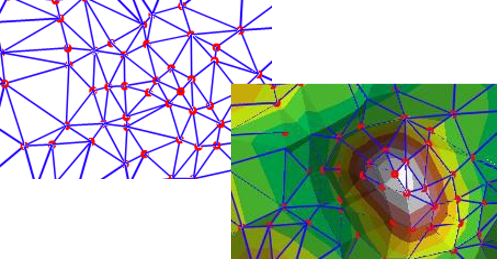
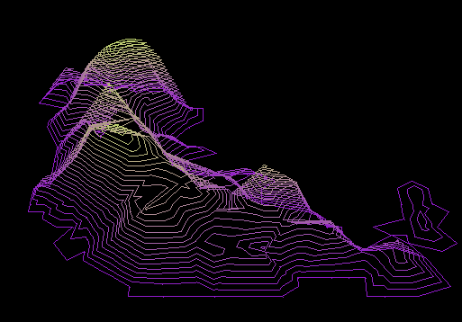
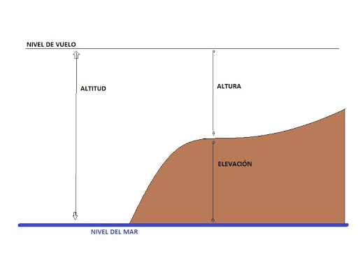
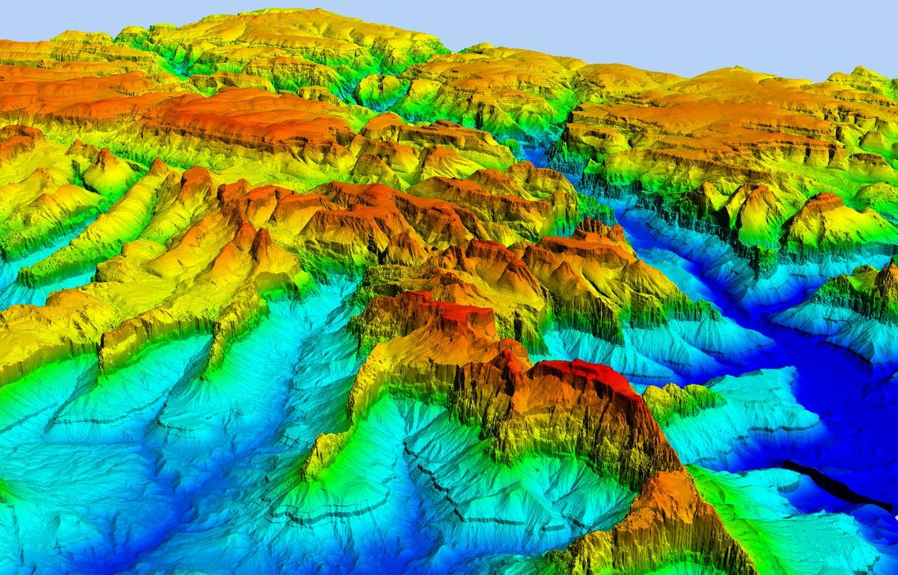
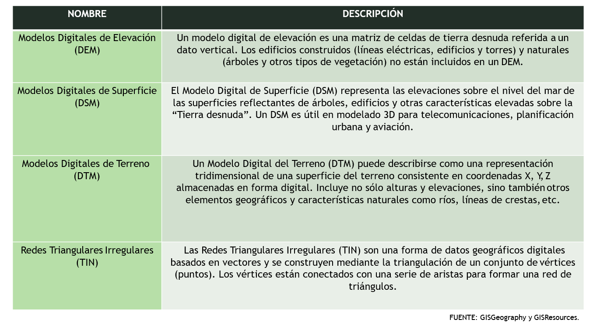
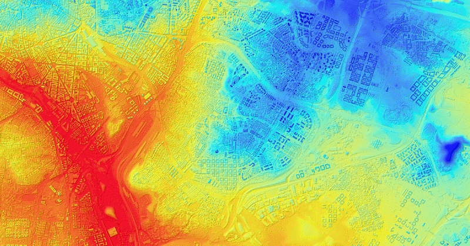

```{r child = "../setup.Rmd"}
```

```{r packages, echo=FALSE, message=FALSE, warning=FALSE}
# AGREGAR PAQUETES A UTILIZAR

```
class: inverse, center, middle

## CLASE 3 
### ANÁLISIS DE SUPERFICIE Y ELEVACIÓN

---

class: inverse, center, middle


---

## ¿Qué es un modelo ?

- Un modelo es un esquema teórico que se elabora con el fin de facilitar el entendimiento de un sistema complejo, así comprender mejor su comportamiento y sus propiedades.
- Los modelos se pueden clasificar en dos grandes grupos:
    - <b>Los modelos físicos:</b> Modelos construidos a escala con materiales adecuados.
    - <b>Los modelos lógicos o simbólicos:</b> Conjunto de entidades que satisfacen un conjunto de restricciones, axiomas y teoremas. 
    



---

## ¿Qué es un modelo de superficie?

- Un modelo de superficie es una representación digital de entidades de un lugar determinado, real o hipotético, que puede trabajarse de manera bidimensional (2D) o tridimensional (3D).
- Un modelo de superficie puede representar distintas variables tales como: contaminación, elevación, profundidades, etc.



---

class: inverse, center, middle

## MODELOS DE SUPERFICIE EN ArcGIS

---

## Raster

- Es un conjunto rectangular de celdas (o píxeles), y cada una de ellas almacena un valor correspondiente a la parte de superficie que cubre.



---

## Red de Triangulación Irregular (TIN)

- Son una forma de datos geográficos digitales basados en vectores y se construyen mediante la triangulación de un conjunto de vértices (puntos) que cubren una superficie determinada.
- Los TIN se forman a partir de un conjunto de valores conocidos, o alturas de puntos, que se utilizan a modo de nodos iniciales en la triangulación.



---

## Curvas de nivel

- Las curvas de nivel son líneas imaginarias que conectan ubicaciones de igual valor en un dataset para representar fenómenos continuos (precipitación, elevación, etc) en una superficie determinada.



---

class: inverse, center, middle

## MODELOS DE ELEVACIÓN Y SUPERFICIE

---

## Elevación, altura y altitud

- Elevación: Distancia vertical entre un punto o nivel en la superficie de la tierra, o unido a ella, y el nivel medio del mar.
- Altitud: Distancia vertical desde un nivel, punto u objeto, al nivel medio del mar.
- Altura: Distancia vertical entre un nivel, punto u objeto, y una referencia específica.




---

## ¿Qué es un DEM?

- Se denomina Modelo Digital de Elevaciones (DEM, por sus siglas en ingles) a un <b>modelo simbólico</b>, de estructura numérica y digital que pretende representar la distribución espacial de la elevación en una superficie determinada.




---

## Otros modelos </br> de elevación y superficie





---


## Otros modelos </br> de elevación y superficie





---

class: inverse, center, middle

## "SURFACE TOOLSET" <br/> de ArcGIS

---

class: inverse, center, middle

## EJEMPLO APLICATIVO 01

### GENERACIÓN DE CURVAS DE NIVEL DE LA CUENCA CHILLÓN

---

class: inverse, center, middle

## EJEMPLO APLICATIVO 02

### CREACIÓN DE MAPAS TOPOGRÁFICOS DE LA CUENCA RÍMAC

---

class: inverse, center, middle

# GRACIAS! <br/>  <a href="mailto: marvinjqs@gmail.com">  </a> 


